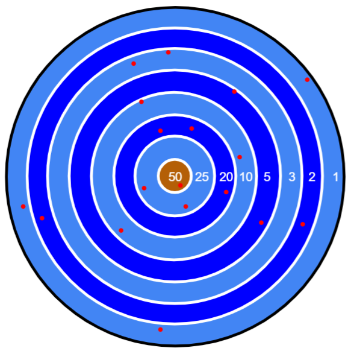
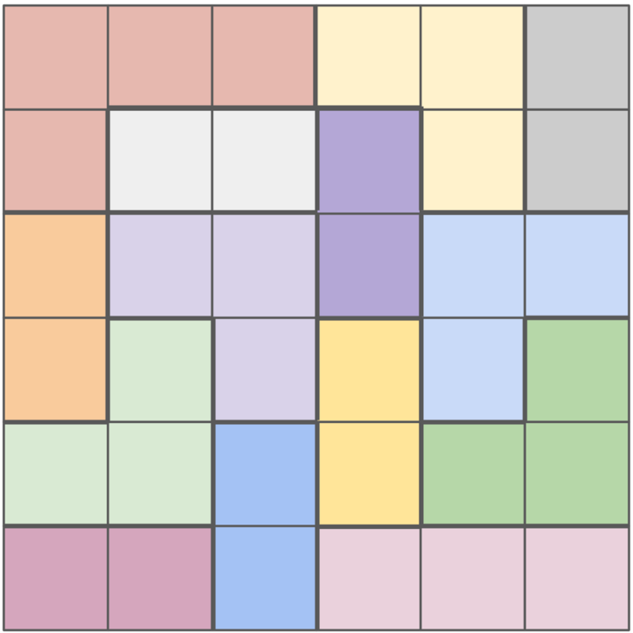

# Mip Master Fun Puzzles
This is a collection of fun puzzles proposed to the Mip Master
community to be solved using MIP.

Most of the puzzles proposed here can be solved with logic in traditional ways,
and we encourage you to do so (consider even sharing with your family and friends!)
However, our goal is to use MIP as a way to exercise our ability of solving challenging
real-world problems.

Solving challenging problems requires systematic approaches.
When using the MIP approach, we put effort into understanding the problem (which we have to 
do any ways), then modeling the problem and implementing the optimization model. 
We do not try to solve the problem, solving is a task for the computer. 

This mindset is crucial to effectively solving real-world analytics problems, 
which is like solving puzzles but in much lager scale.
After all, you can certainly solve a 9X9-sudoku without a computer, but how about solving a 81x81-sudoku?

## #4 - Darts
_Jul 2021_  
Draw a continuous line that visits every empty cell of the grid exactly once. 
The line can start in any empty cell, but it can only move to a horizontal or vertical 
adjacent cell (diagonal moves are not allowed). 
The line must not visit any of the colored cells.  
  

_Source: Mip Master team._  
Solution: Will be posted soon.

## #3 - Digits Tracking
_Jun 2021_  
Consider the list of cells in the figure below.  
  
Each cell has a label which is a digit from 0 to 9. 
The goal is to place a digit, from 0 to 9, in each of the 10 cells in a way that the digit placed 
in cell _i_ equals the number of times the digit _i_ appears in the list.
For example, if digit 2 is placed in Cell 1, then digit 1 must be placed in exactly two cells.

_Source: [Puzzle Corner - MIT](https://cs.nyu.edu/~gottlieb/tr/back-issues/)._  
[Solution](3_digits_tracking)

## #2 - Even/Odd Sudoku
_Jun 2021_  
Same rules of the standard sudoku, i.e., the digits 1 through 9 into the grid so that no digit repeats 
in any row, column, or bold region. In addition, cells with a square must contain an even digit 
and cells with a circle must contain an odd digit.  

_Source: [The Art of Puzzles](https://www.gmpuzzles.com/blog/2021/03/even-odd-sudoku-by-swaroop-guggilam/)._  
[Solution](2_even_odd_sudoku)

## #1 - Clueless Sudoku
_May 2021_
Same rules of the standard sudoku, i.e., fill the digits 1 through 6 into the grid so that no digit repeats 
in any row, column, or bold region. In addition, the sum of the digits in every bold region is the same.

There are 14 bold regions (also called blocks) as can be identified by the different colors in the figure and also
defined here:    
`1: [(1, 1), (1, 2), (1, 3), (2, 1)], 2: [(1, 4), (1, 5), (2, 5)], 3: [(1, 6), (2, 6)], 4: [(2, 2), (2, 3)], 
5: [(2, 4), (3, 4)], 6: [(3, 1), (4, 1)], 7: [(3, 2), (3, 3), (4, 3)], 8: [(3, 5), (3, 6), (4, 5)], 
9: [(5, 1), (5, 2), (4, 2)], 10: [(4, 4), (5, 4)], 11: [(5, 5), (5, 6), (4, 6)],
12: [(6, 1), (6, 2)], 13: [(5, 3), (6, 3)], 14: [(6, 4), (6, 5), (6, 6)]`

_Source: Adapted from the book
[The Opex Analytics Weekly Puzzle](https://www.amazon.com/Opex-Analytics-Weekly-Puzzle-Probability/dp/1731343647)._  
[Solution](1_clueless_sudoku)